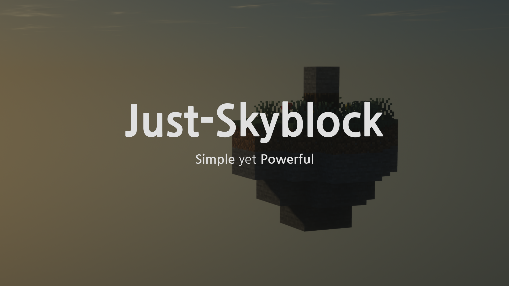

# JustSkyblock

## Abstract
JustSkyblock, Skyblock Server Plug-in. Easily build a powerful Skyblock server on PowerNukkit or NukkitX. Skyblock, quarry, custom name tag, skyblock UX, everything can be built with JustSkyblock. Don't worry about combining and setting up multiple plug-ins anymore. JustSkyblock is designed to deliver JustSkyblock's experience as powerful and natural as possible without harming the vanilla Minecraft experience. Complete the Skyblock server where all features are naturally synchronized.

## Features

#### Skyblock Feature
* Skyblock Island generation and assignment
* Skyblock Island ``lock``, ``protection`` and ``sharing``
* Skyblock Island-related chunk managment logic

#### Resource Block Freature
* Virtual quarry ``Resource Block``
* Upgradable Resource block ― Place the same level of Resource Blocks on the floor at 3*3.
* Provide ``Resource Pack`` for Resource Block

#### UX Frature
* Additional ``Custom Recipes`` / ``Banned Recipes``
* ``Basic Items`` and ``Personalization Guidebook``

#### Management Freature
* Term-settable ``Ban System``
* Customizable ``Kick System``

#### Custom Name-Tag Feature
* Customize player chatting format and name tag using ``Player Groups``

#### Database Support
* ``MySQL`` / ``SQLite`` Database Support
* Use pre-compiled SQL queries
* No SQL Injection and Database overhead issues

#### Multi-Language Support
* All commands, Messages and Text, everything is editable
* Multi-language support: Currently only ``English`` and ``Korean``, ``Japanese``, ``Simplified Chinese`` are supported.

## Getting Started

### Download Plug-in
To download this plug-in, you can download the latest release from the [releases gage](https://github.com/junghyun397/JustSkyblock/releases) and the latest build version from [ActionsCI](https://github.com/junghyun397/JustSkyblock/actions). The master branch is developed in PowerNukkit API, and NukkitX API version is developed in nukkitx branch. The nukkitx branch is updated when a new version is released.

### Install Resource Pack
JustSkyblock is completed with a Resource Pack. Put ``JustSkyblock_Resource_Pack.mcpack`` file in the ``resource_packs`` folder to applying the Resource Pack. Resource Pack works seamlessly regardless of the block id used by Resource Block, and only supports up to LV5 Resource Block.

### Edit server.properties
1. Set the ``level-type`` option in the server.properties file to ``EMPTY``. Only when set to the ``EMPTY`` option can JustSkyblock create an empty world to allocate islands normally. The existing world must be deleted after the option is set.
2. Set the ``allow-nether`` option in server.properties file to ``off``, In the default settings, one of Resource Block use netherack block id.

### Additional plugins
JustSkyblock is built without considering being used with other plug-ins. Applying other plug-ins, especially those with teleport or block management, is not validated and cannot guarantee fully operation. If you need to apply other plug-ins additionally, please avoid plug-ins with teleport or block management functions as much as possible.
